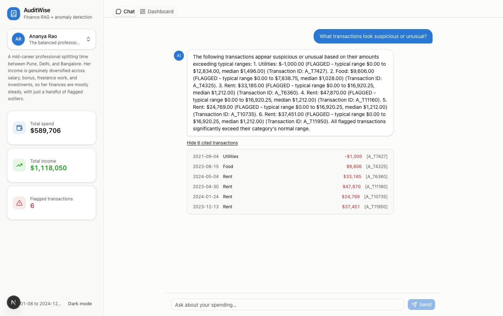
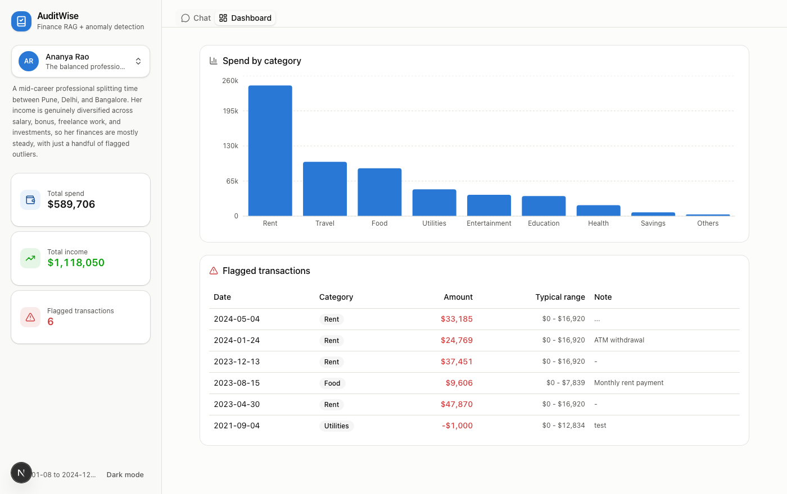

# AuditWise

**Ask your finances a question. Get a real answer, not a guess.**


AuditWise is a full-stack finance assistant that turns a pile of messy
transaction data into grounded, cited answers, and automatically flags the
transactions that don't fit the pattern. Ask it *"how much did I spend on
food in March"* and it doesn't guess: it filters your real data, does the
arithmetic in code, and only ever lets the AI narrate the result, with the
receipts to prove it.



## Why this exists

Personal finance tools tend to either dump a spreadsheet on you or paper
over the details with a chatbot that occasionally invents numbers.
AuditWise is built to do neither:

- **Grounded, not guessed.** Every number comes from real computed data,
  never an LLM's arithmetic, and every claim cites the exact transaction
  IDs behind it.
- **Explainable anomaly detection.** No black-box fraud model. Transactions
  are flagged using per-category statistics simple enough to explain in one
  sentence, and the assistant can tell you exactly why something got flagged.
- **A hybrid retrieval design that's actually defensible**, not RAG for the
  sake of using RAG. See [how it works](#how-it-works) below.

## Try it

```
"How much did I spend on food in March 2022?"
"What's my average monthly subscription spend?"
"What transactions look suspicious or unusual this month?"
"Why was this transaction flagged?"
```

Three curated demo profiles ship with the app, each a real slice of the
dataset with a distinct financial story: a balanced professional, a
freelancer whose irregular income triggers more flags, and a volatile
profile with the most flagged transactions in the dataset. Switch between
them from the account switcher in the sidebar, no login required.



## Quick start

```bash
cp .env.example .env   # add your OPENAI_API_KEY

make setup      # installs deps, cleans the data, builds the vector DB (~2 min, calls the OpenAI embeddings API)
make backend    # terminal 1: starts the API on :8000
make frontend   # terminal 2: installs frontend deps and starts the UI on :3000
```

Open `http://localhost:3000`. That's it.

Prefer to see each step individually instead of one `make setup` call? Run the
scripts one at a time, in this order: `combine_datasets`, `clean_amount`,
`clean_dates`, `clean_categories`, `clean_payment_mode`, `dedupe`,
`anomaly_detection`, `chunking`, `embed_and_store` (each via
`python3 -m src.<name>`), then `python3 -m uvicorn api.main:app --port 8000`.

## How it works

The standard approach to RAG (embed everything, retrieve the most similar
chunks, hand them to an LLM) is great for "find things related to X." It's
bad at "how much did I spend in March," because vector similarity doesn't
guarantee exhaustive retrieval, and an LLM shouldn't be trusted to sum a
list of numbers handed to it as text.

So retrieval here is structured first:

1. An LLM reads the question and extracts structured filters: date range,
   category, income vs. expense, "flagged only," and the aggregation being
   asked for (sum, average, or count).
2. Those filters are applied directly to the cleaned data with pandas:
   exact, not approximate.
3. Any arithmetic is computed in code, never by the LLM.
4. Vector search over transaction notes handles only the genuinely fuzzy
   part, free-text description matching, combined with the same structured
   filters through Chroma's metadata `where` clause.
5. The LLM's only job at the end is turning the filtered data and
   precomputed number into a natural-language answer, citing transaction IDs.

Every retrieval call is scoped to a single `user_id`, passed in by the
caller and never inferred from the question text, so one user's data can
never leak into another's answer.

**Anomaly detection** flags transactions using per-category IQR
(interquartile range) bounds, not z-score and not a trained model. A
$5,000 Rent payment is normal; a $5,000 Food purchase isn't, so bounds are
computed separately within each of 14 spending categories. IQR beats
z-score here because z-score's mean and standard deviation are themselves
distorted by the extreme values you're trying to catch, while IQR's
median-based spread stays stable, a better fit for the right-skewed
distribution real spending data has.

## Architecture

```
Kaggle CSVs (2x)
      │
      ▼
 combine → clean amounts/dates/categories/payment_mode → dedupe → anomaly detection
      │
      ├──────────────► chunking → OpenAI embeddings → Chroma vector DB
      │                                                      │
      ▼                                                      │
 cleaned DataFrame  ◄──────── pandas structured filter ───────┤
      │                              │                        │
      │                              ▼                        ▼
      │                     precomputed aggregate      semantic search hits
      │                              │                        │
      └──────────────────────────────┴────────────┬───────────┘
                                                    ▼
                                        LLM generation (cited answer)
                                                    │
                                                    ▼
                                        FastAPI (api/main.py)
                                                    │
                                                    ▼
                                  Next.js frontend (chat + dashboard)
```

## Data pipeline (`src/`)

Two public Kaggle "BudgetWise" synthetic personal-finance datasets,
combined into roughly 31,700 rows and deliberately messy: four or more
mixed date formats in one column, currency-symbol amounts, typo'd
categories (`Food`/`FOOD`/`ood`), duplicate rows, and duplicate transaction
IDs that turn out to be two different transactions colliding by
coincidence rather than true duplicates. Each cleaning step below is a
small, independently runnable script that prints a sanity check and writes
an intermediate CSV.

| Script | What it does |
|---|---|
| `combine_datasets.py` | Merges both CSVs, namespaces `user_id`/`transaction_id` with `A_`/`B_` prefixes |
| `clean_amount.py` | Strips currency symbols; nulls out sentinel placeholder values (`999999`, `999999999`) rather than treating them as real amounts |
| `explore_dates.py` / `clean_dates.py` | Classifies each row into one of 7 raw date formats, proves day-first vs. month-first per format using evidence in the data itself (a `26` in the first slot can't be a month), then parses each format with its own exact `strptime` string |
| `clean_categories.py` / `clean_payment_mode.py` | Fuzzy-matches (`difflib`) typo and casing variants down to a fixed canonical set: 238 raw category strings collapse to 14 real categories |
| `dedupe.py` | Drops true exact-duplicate rows. For rows that only share a broken `transaction_id` with an unrelated transaction, keeps both and reassigns a new ID rather than deleting real data |
| `anomaly_detection.py` | Per-category IQR anomaly flagging |
| `chunking.py` | One transaction equals one retrieval chunk |
| `embed_and_store.py` | Embeds every chunk (OpenAI `text-embedding-3-small`) into a local Chroma vector DB, rebuilding from scratch each run so it can't silently drift stale |
| `retrieval.py` | LLM tool call extracts filters, applies pandas filtering/aggregation, falls back to Chroma semantic search for the free-text remainder |
| `generation.py` | Builds the cited, grounded answer from precomputed data |

## Tech stack

| Layer | Tech |
|---|---|
| Data cleaning & anomaly detection | Python, pandas |
| Embeddings & generation | OpenAI (`text-embedding-3-small`, `gpt-4o-mini`) |
| Vector database | Chroma (local, persistent) |
| Backend API | FastAPI |
| Frontend | Next.js 16, TypeScript, Tailwind CSS, shadcn/ui, Recharts |

## Evaluation

`eval/eval_set.py` contains 19 question/answer pairs against a fixed demo
user, with expected values computed independently in pandas rather than
derived from the pipeline itself. Covers per-category sums, income vs.
expense, date-range filtering, averages, counts, anomaly-only queries, and
direct transaction-ID lookups.

```bash
python3 -m eval.run_eval
```

Currently **19 of 19 passing**. One bug the eval set itself surfaced during
development: "what's my total income" was initially unanswerable because
the filter-extraction schema had no way to represent income vs. expense,
only category. Fixed by adding a `transaction_type` filter dimension.

## Limitations and what's next

- **List completeness in generated prose.** The retrieval layer reliably
  finds every matching transaction, but the LLM's natural-language summary
  can occasionally drop an item when listing many results. Structured
  output enforcement would close this gap.
- **Synthetic data quality ceiling.** Transaction `notes` appear to be
  randomly generated rather than genuinely tied to category or amount,
  which caps how useful semantic search over notes can be.
- **No real authentication.** The account switcher is a stand-in for
  login. `user_id` scoping is enforced everywhere it matters, but there's
  no session/auth layer.
- **Next up: user-uploaded statements.** The cleaning functions are
  already written as reusable `add_clean_x(df)` functions, so extending
  this to arbitrary user-uploaded CSVs mainly means making the category
  and payment-mode matching adaptive, and moving embeddings to happen at
  upload time instead of being precomputed once.

## Data source

"BudgetWise" synthetic personal finance datasets (Kaggle): two files,
`budgetwise_finance_dataset.csv` and `budgetwise_synthetic_dirty.csv`,
combined and deliberately messy for a stronger data-engineering story.
